# Zoe - Personal Workspace App

A modern, joyful Flutter app for organizing thoughts, tasks, and ideas with beautiful simplicity. Built with a Notion-like structure featuring sheets and dynamic content blocks with collaboration capabilities.

## Features

- **Personal Organization**: Create and manage sheets for different aspects of your life
- **8 Content Block Types**: Text, Tasks, Events, Bullet Lists, Links, Documents, Polls, and Lists
- **Real-time Updates**: Instant data persistence with every keystroke
- **Collaboration**: Share sheets with team members, assign tasks, and manage user access
- **Sharing & Deep Linking**: Share sheets and content via links with deep link support for seamless navigation
- **Quick Search**: Powerful search across all content types with filtering capabilities
- **Rich Text Editing**: HTML support with Quill editor for formatted content
- **Media Support**: Upload and manage images, videos, audio files, and documents
- **Task Management**: Assign tasks to team members with due dates and completion tracking
- **Polling System**: Create polls with multiple choice options and vote tracking
- **Profile Management**: Customize user profiles with avatars, bio, and personalization
- **Beautiful UI**: Modern design with smooth animations and intuitive interactions
- **Cross-platform**: Works on iOS, Android, Web, and Desktop
- **Robust State Management**: Built with Riverpod for reliable, reactive state handling

## Screenshots

### Home & Navigation
<div align="center">
  <table>
    <tr>
      <td align="center"><strong>Light Mode</strong></td>
      <td align="center"><strong>Dark Mode</strong></td>
    </tr>
    <tr>
      <td>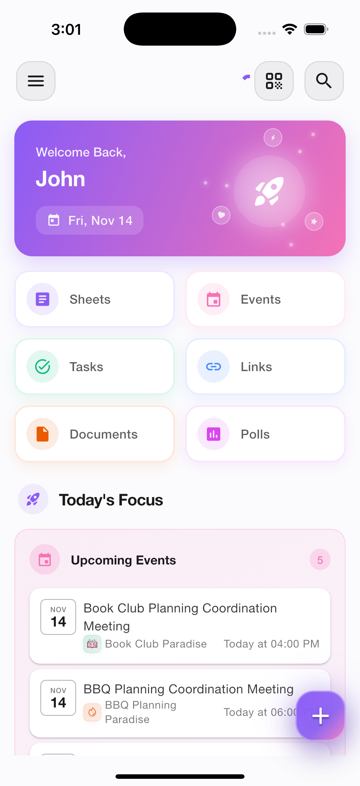</td>
      <td>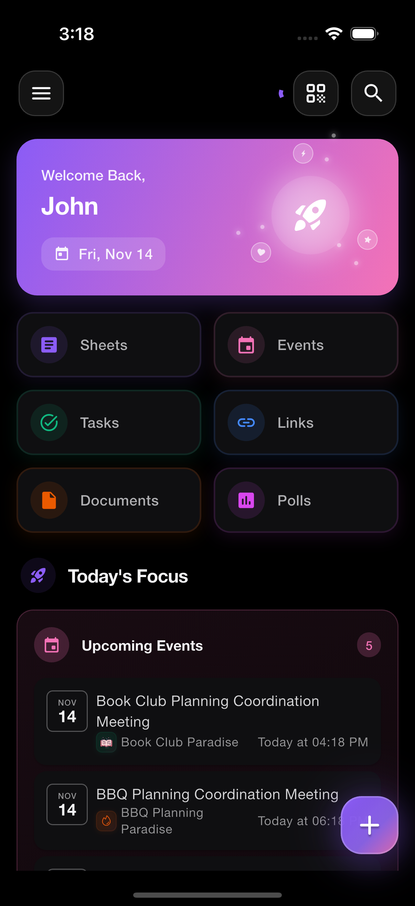</td>
    </tr>
  </table>
  <p><strong>Home Screen</strong> - Main dashboard with quick access to all sheets and content</p>
  
  <table>
    <tr>
      <td align="center"><strong>Light Mode</strong></td>
      <td align="center"><strong>Dark Mode</strong></td>
    </tr>
    <tr>
      <td>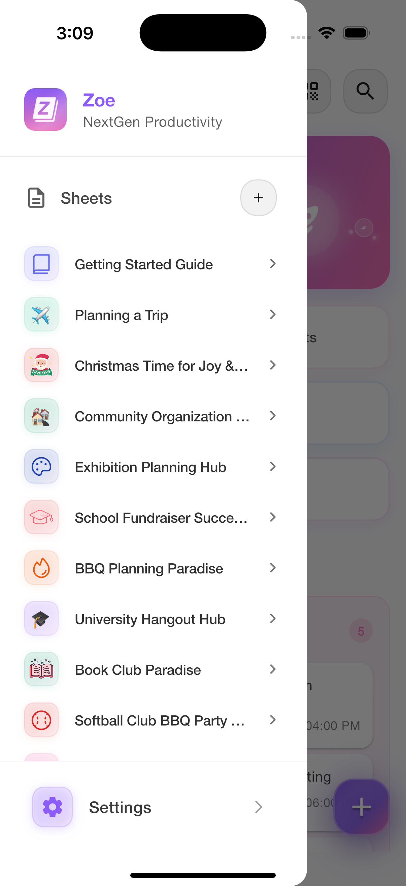</td>
      <td>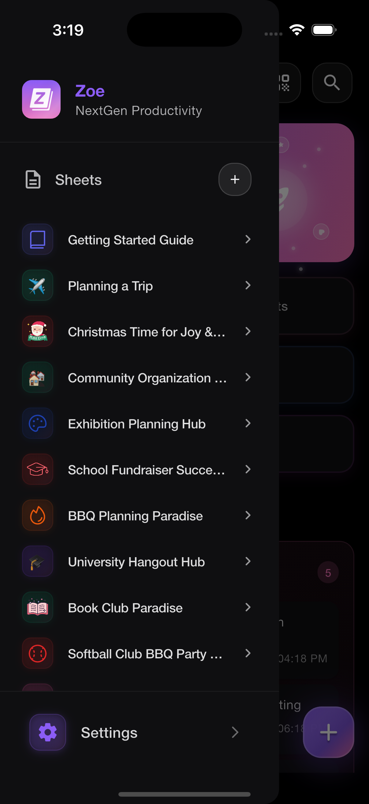</td>
    </tr>
  </table>
  <p><strong>Navigation Drawer</strong> - Quick access to all features and navigation options</p>
</div>

### Sheets Management
<div align="center">
  <table>
    <tr>
      <td align="center"><strong>Light Mode</strong></td>
      <td align="center"><strong>Dark Mode</strong></td>
    </tr>
    <tr>
      <td>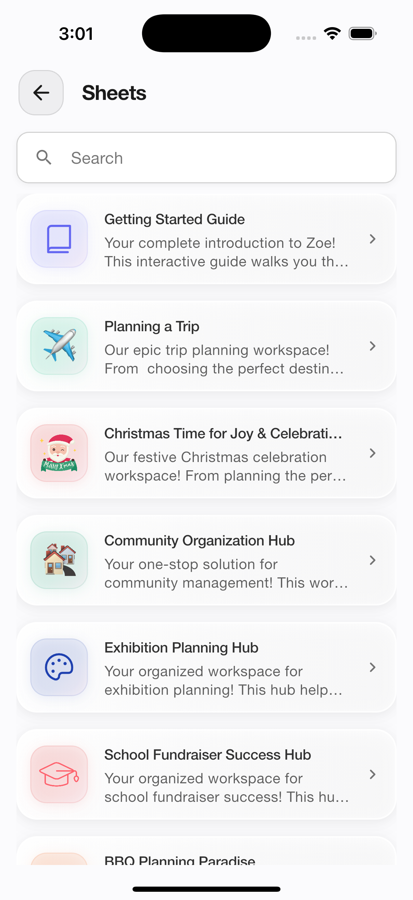</td>
      <td>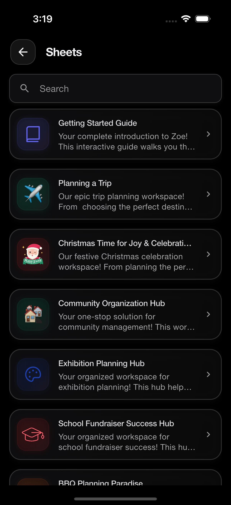</td>
    </tr>
  </table>
  <p><strong>Sheets List</strong> - Organize your workspace with custom sheets, avatars, and cover images</p>
  
  <table>
    <tr>
      <td align="center"><strong>Light Mode</strong></td>
      <td align="center"><strong>Dark Mode</strong></td>
    </tr>
    <tr>
      <td>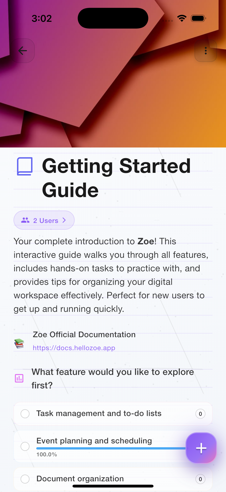</td>
      <td>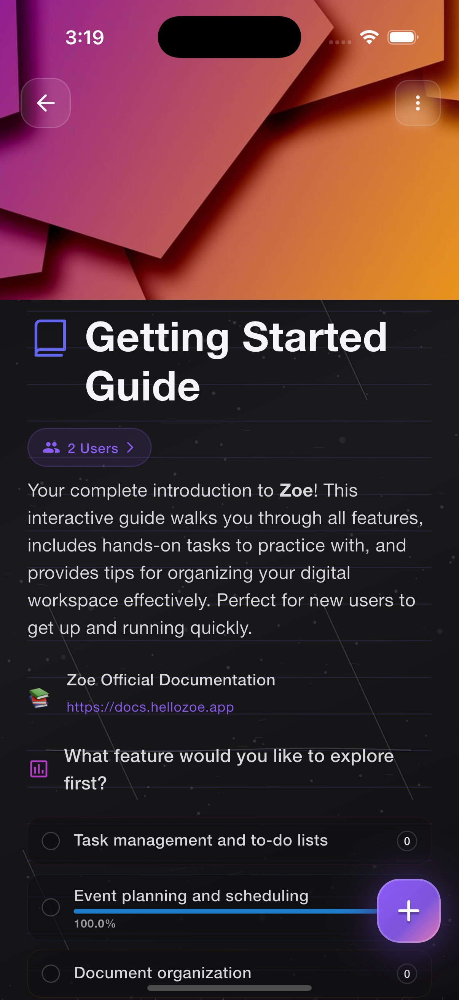</td>
    </tr>
  </table>
  <p><strong>Sheet Detail</strong> - View and manage all content blocks within a sheet</p>
</div>

### Content Types
<div align="center">
  <table>
    <tr>
      <td align="center"><strong>Light Mode</strong></td>
      <td align="center"><strong>Dark Mode</strong></td>
    </tr>
    <tr>
      <td>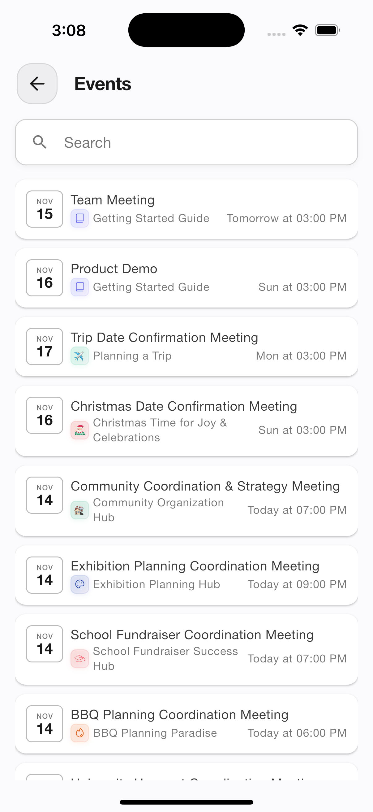</td>
      <td>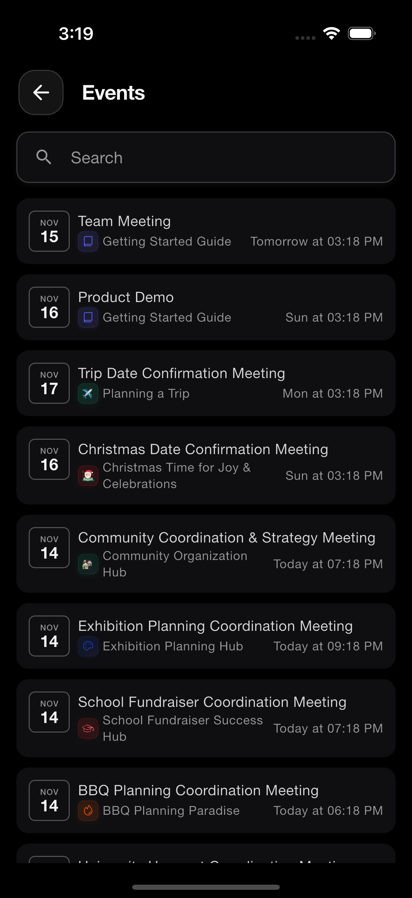</td>
    </tr>
  </table>
  <p><strong>Event Scheduling</strong> - Plan and track events with start/end dates and detailed descriptions</p>
  
  <table>
    <tr>
      <td align="center"><strong>Light Mode</strong></td>
      <td align="center"><strong>Dark Mode</strong></td>
    </tr>
    <tr>
      <td>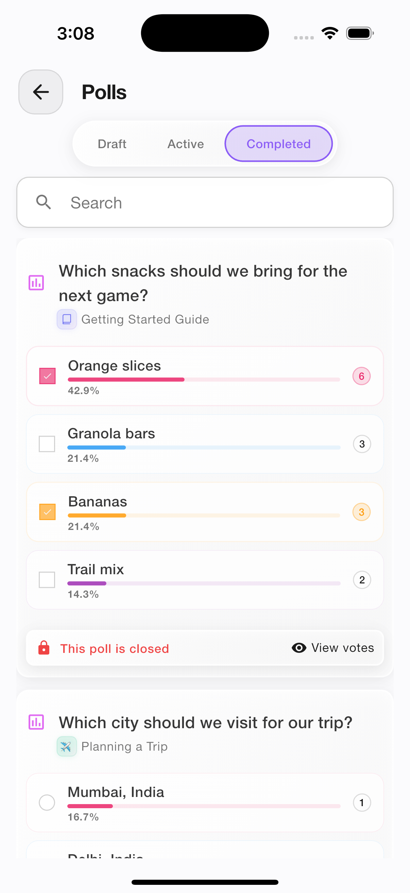</td>
      <td>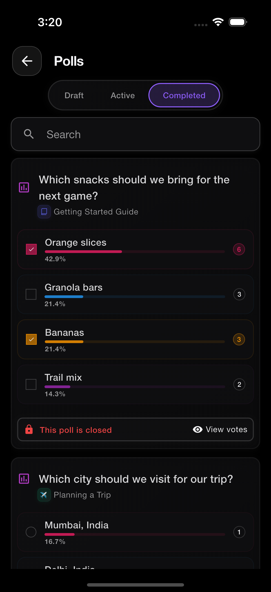</td>
    </tr>
  </table>
  <p><strong>Interactive Polls</strong> - Create polls with multiple choice options and real-time voting</p>
  
  <table>
    <tr>
      <td align="center"><strong>Light Mode</strong></td>
      <td align="center"><strong>Dark Mode</strong></td>
    </tr>
    <tr>
      <td>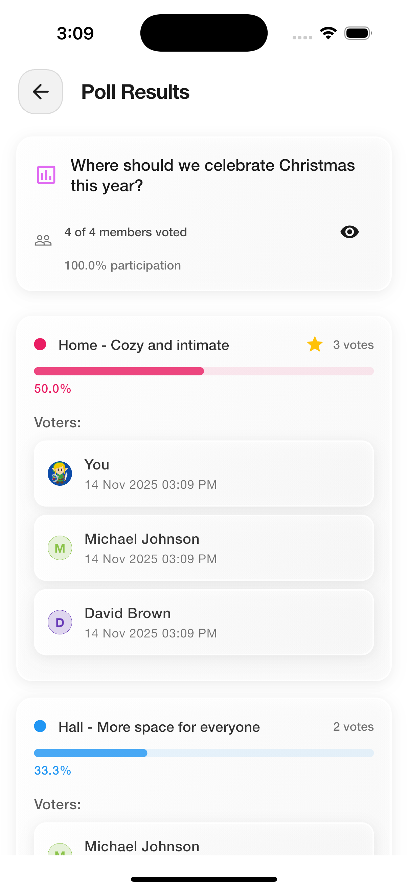</td>
      <td>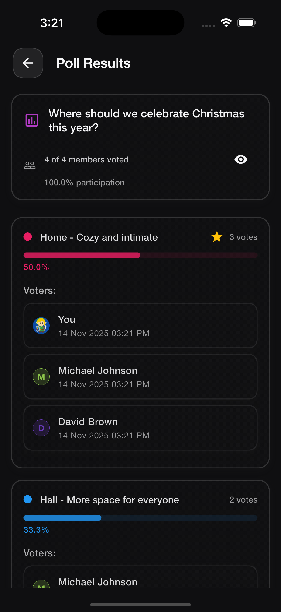</td>
    </tr>
  </table>
  <p><strong>Poll Results</strong> - View poll results with vote counts and percentages</p>
  
  <table>
    <tr>
      <td align="center"><strong>Light Mode</strong></td>
      <td align="center"><strong>Dark Mode</strong></td>
    </tr>
    <tr>
      <td>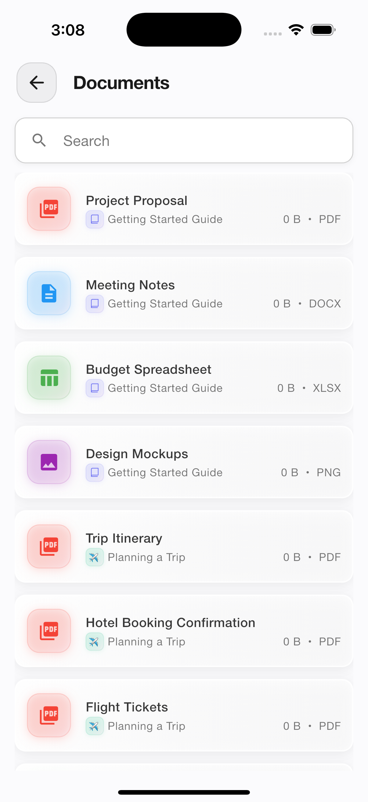</td>
      <td>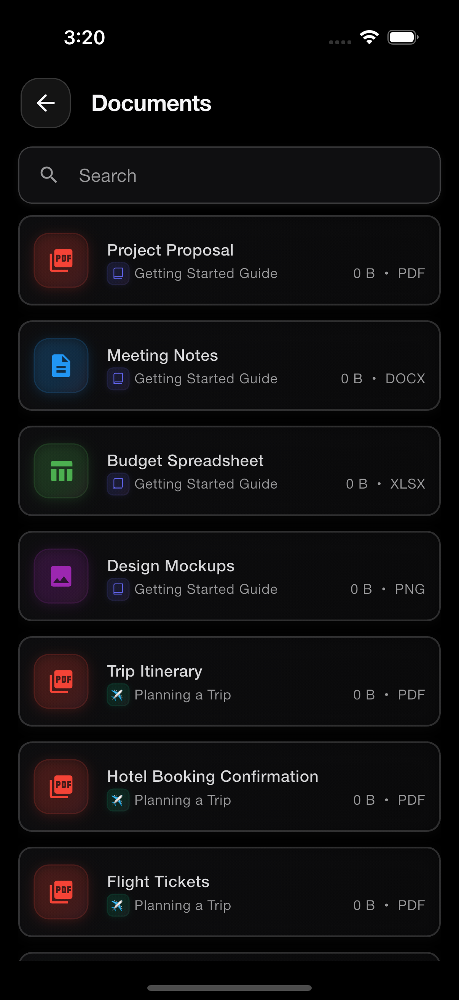</td>
    </tr>
  </table>
  <p><strong>Document Management</strong> - Upload and preview images, videos, audio files, and PDFs</p>
</div>

### Collaboration & Sharing
<div align="center">
  <table>
    <tr>
      <td align="center"><strong>Light Mode</strong></td>
      <td align="center"><strong>Dark Mode</strong></td>
    </tr>
    <tr>
      <td>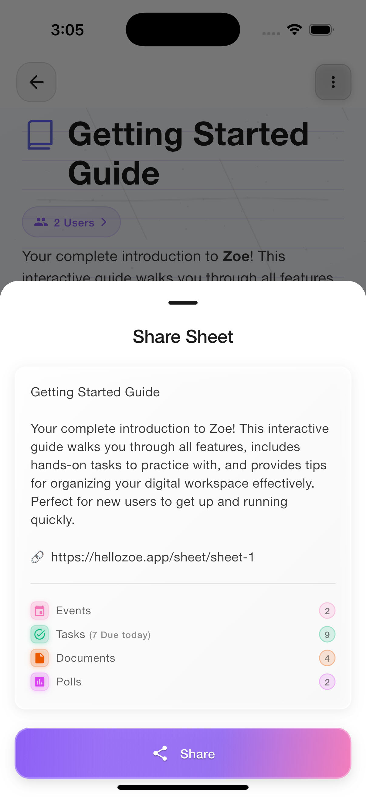</td>
      <td>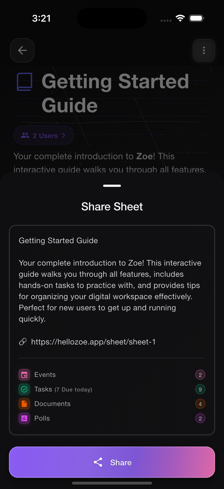</td>
    </tr>
  </table>
  <p><strong>Share Sheet</strong> - Share sheets with team members via links with deep link support</p>
  
  <table>
    <tr>
      <td align="center"><strong>Light Mode</strong></td>
      <td align="center"><strong>Dark Mode</strong></td>
    </tr>
    <tr>
      <td>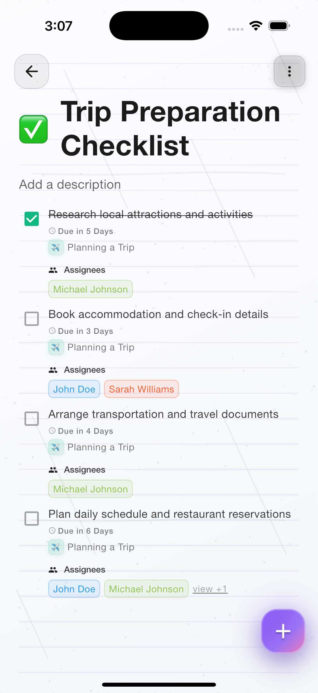</td>
      <td>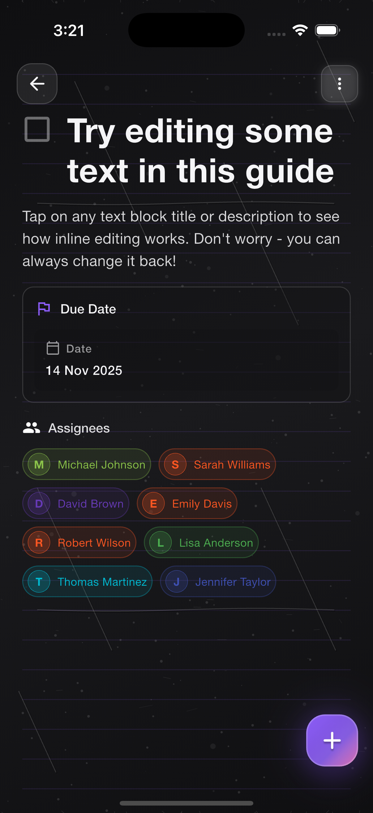</td>
    </tr>
  </table>
  <p><strong>Task Assignment</strong> - Assign tasks to multiple team members with user selection</p>
</div>

### Search & Discovery
<div align="center">
  <table>
    <tr>
      <td align="center"><strong>Light Mode</strong></td>
      <td align="center"><strong>Dark Mode</strong></td>
    </tr>
    <tr>
      <td>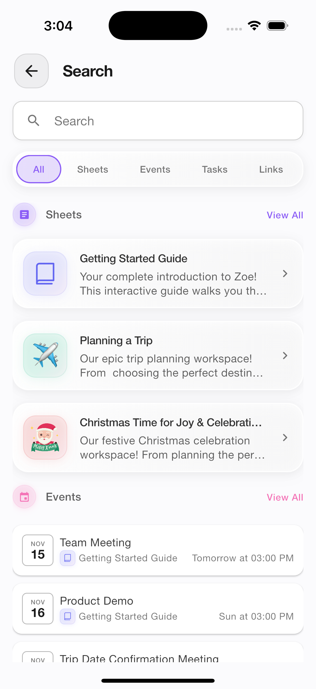</td>
      <td>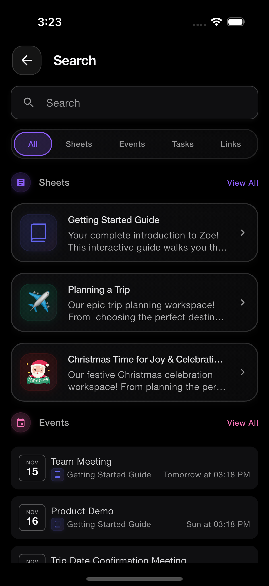</td>
    </tr>
  </table>
  <p><strong>Quick Search</strong> - Search across all content types with category filtering (Sheets, Events, Tasks, Links, Documents, Polls)</p>
</div>

### Profile & Settings
<div align="center">
  <table>
    <tr>
      <td align="center"><strong>Light Mode</strong></td>
      <td align="center"><strong>Dark Mode</strong></td>
    </tr>
    <tr>
      <td>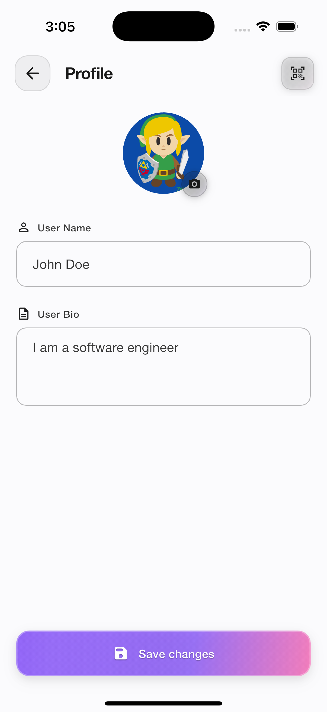</td>
      <td>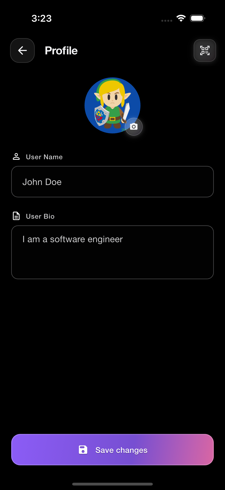</td>
    </tr>
  </table>
  <p><strong>User Profile</strong> - Customize your profile with avatar, name, and bio</p>
  
  <table>
    <tr>
      <td align="center"><strong>Light Mode</strong></td>
      <td align="center"><strong>Dark Mode</strong></td>
    </tr>
    <tr>
      <td>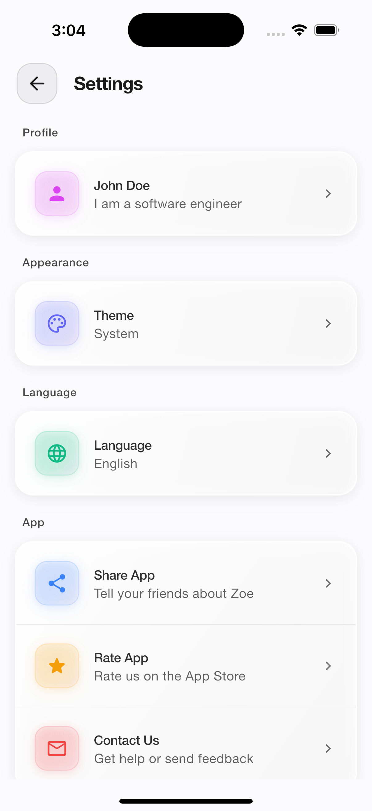</td>
      <td>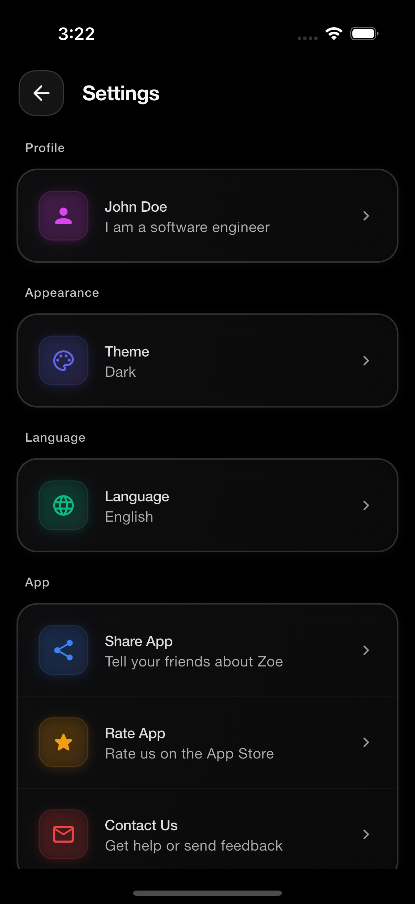</td>
    </tr>
  </table>
  <p><strong>Settings</strong> - Manage theme (light/dark mode), language preferences, and app settings</p>
</div>

## Architecture

The app follows a clean, modular architecture with separation of concerns:

### Core Components
- **SheetListProvider**: Manages all sheet operations and state using StateNotifier
- **Content System**: Modular content providers for each content type
- **Router Integration**: Go Router for smooth navigation
- **Theme System**: Comprehensive theming with dark/light mode support

### Content Management
- **TextContentListNotifier**: Handles text content with immediate persistence and HTML support
- **TaskListNotifier**: Manages tasks with assignment, due dates, and completion tracking
- **EventsContentListNotifier**: Event scheduling and tracking with start/end dates
- **BulletsContentListNotifier**: Dynamic bullet-point lists with real-time editing
- **LinkListNotifier**: URL link management and organization
- **DocumentListNotifier**: File and media document handling
- **PollListNotifier**: Poll creation, voting, and results tracking
- **ListListNotifier**: Generic list content management

### State Management
- **Riverpod Integration**: Modern reactive state management
- **Provider Family**: Stable controllers for form inputs
- **StateNotifier Pattern**: Predictable state updates
- **Auto-dispose**: Efficient memory management

## Content Block Types

1. **Text Content**: Rich text with HTML support, titles, and descriptions using Quill editor
2. **Tasks**: Task management with checkboxes, descriptions, due dates, and user assignment
3. **Events**: Event scheduling with start/end dates, titles, and detailed descriptions
4. **Bullet Lists**: Dynamic bullet-point lists with real-time editing and descriptions
5. **Links**: URL link management with titles, descriptions, and emoji icons
6. **Documents**: File attachments supporting images, videos, audio, PDFs, and other file types
7. **Polls**: Interactive polls with multiple choice options, voting, and results tracking
8. **Lists**: Generic list containers that can hold various content types

## Design Philosophy

- **Joyful**: Delightful animations and micro-interactions
- **Modern**: Clean, contemporary design language with relevant icons
- **Productive**: Focus on getting things done efficiently
- **Flexible**: Adaptable to different organizational needs
- **Reliable**: Robust error handling and data persistence

## Technologies Used

- **Flutter**: Cross-platform UI framework
- **Dart**: Programming language
- **Riverpod**: Advanced state management with code generation
- **Go Router**: Declarative routing with deep linking support
- **Flutter Quill**: Rich text editor with HTML support
- **Share Plus**: Content sharing capabilities
- **File Picker**: File and media selection
- **Image Picker**: Camera and gallery integration
- **Cached Network Image**: Efficient image loading and caching
- **Video Player**: Video playback support
- **Audio Players**: Audio playback support
- **Mobile Scanner**: QR code scanning
- **Pretty QR Code**: QR code generation
- **Emoji Picker**: Emoji selection for content
- **Google Fonts**: Typography
- **Flutter Animate**: Smooth animations
- **Lottie**: Animation support
- **flutter_rust_bridge**: Rust integration for performance
- **SharedPreferences**: Local data persistence
- **URL Launcher**: External link handling
- **Intl**: Internationalization and date formatting

## Key Features Implemented

✅ **Real-time Data Persistence**: Every change saves instantly
✅ **8 Content Types**: Text, Tasks, Events, Bullets, Links, Documents, Polls, and Lists
✅ **Rich Text Editor**: HTML support with Quill editor for formatted content
✅ **Task Assignment**: Assign tasks to team members with due dates and completion tracking
✅ **Sheet Collaboration**: Share sheets with multiple users and manage membership
✅ **Sharing & Deep Linking**: Share sheets and content via links with deep link navigation
✅ **Quick Search**: Search across all content types with category filtering
✅ **Media Support**: Upload and preview images, videos, audio files, and documents
✅ **Polling System**: Create polls with multiple choice options and real-time vote tracking
✅ **Profile Management**: User profiles with customizable avatars, bio, and settings
✅ **Event Scheduling**: Create events with start/end dates and detailed descriptions
✅ **Stable Text Editing**: No reverse typing or controller recreation issues
✅ **Modular Content System**: Clean separation of content types with dedicated providers
✅ **Robust Error Handling**: Graceful fallbacks and error recovery
✅ **Modern UI/UX**: Bottom sheets, smooth animations, and intuitive design
✅ **Cross-platform Support**: Works across all Flutter-supported platforms
✅ **Theme Management**: Light/dark mode with system preference detection
✅ **Localization**: Multi-language support with i18n
✅ **Navigation System**: Clean routing with Go Router integration

## Future Enhancements

- [ ] Cloud synchronization and backup
- [ ] Real-time collaborative editing
- [ ] Advanced export options (PDF, Markdown, JSON)
- [ ] Custom themes and color schemes
- [ ] Notification system for tasks and events
- [ ] Calendar view for events
- [ ] Advanced analytics and insights
- [ ] Offline-first architecture with sync
- [ ] Performance optimizations for large datasets
- [ ] WhatsApp group integration enhancements
- [ ] QR code generation for quick sharing

## Getting Started

1. **Prerequisites**: Flutter SDK (latest stable version)
2. **Installation**: 
   ```bash
   flutter pub get
   flutter run
   ```
3. **Platform Setup**: Follow Flutter's platform-specific setup guides

## Contributing

This is a fully functional personal workspace application. Contributions are welcome! Please follow the existing architecture patterns and state management approaches.

## License

This project is for demonstration and educational purposes.
